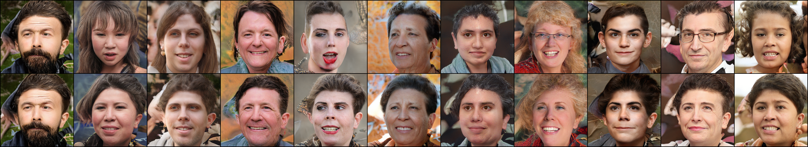
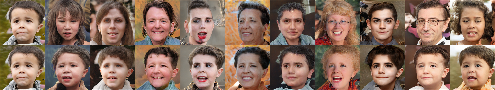
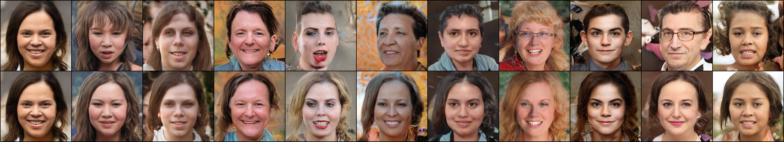
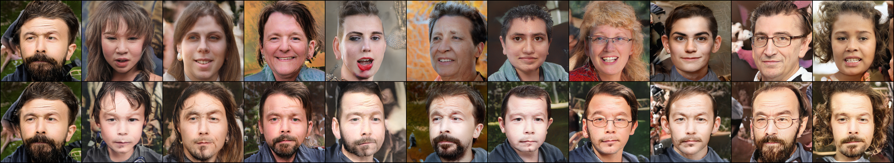
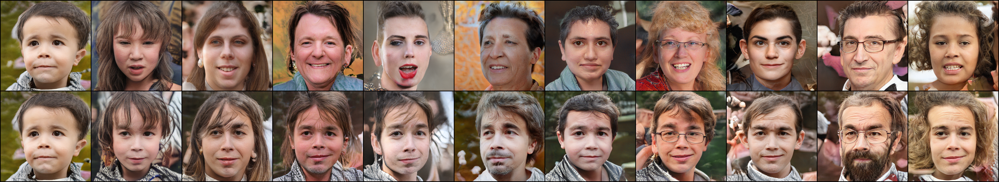
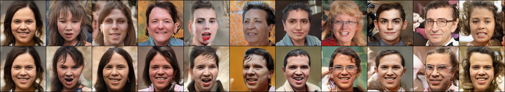
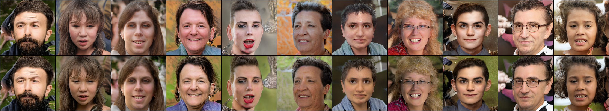
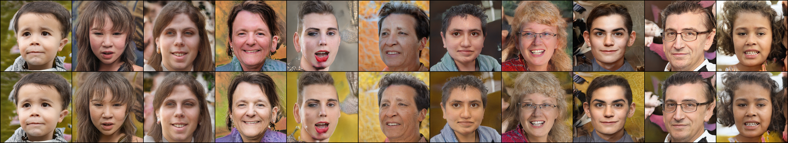
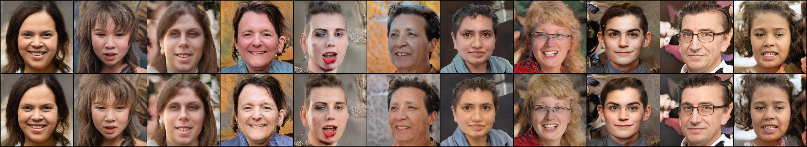

# Style Transfer functionality for StyleGAN 2 in PyTorch

Refer to [this](https://www.youtube.com/watch?v=kSLJriaOumA) video for understanding style transfer

Use the colab notebook [stylegan-2-style-transfer.ipynb](stylegan_2_style_transfer.ipynb) for complete implementation

#### Coarse Style transfer
Transfer posture and hair  
Refer `transfer_coarse_latent` in colab

Transfer facial features such as eyes and nose  
Refer `transfer_middle_latent` in colab

Transfer minor features - mainly color scheme  
Refer `transfer_fine_latent` in colab

